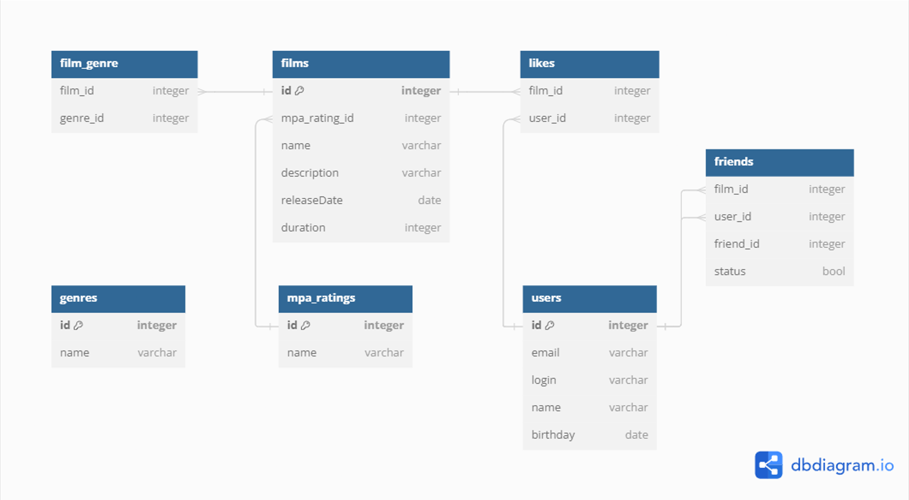

# Java Filmorate
## Описание проекта
**Restful API back-end для сервиса любителей кино. Включает хранение, взаимодействие и управление: 
фильмами, пользователями, жанрами и рейтингом.**

## Стэк технологий
- Java 11, Spring Boot, Maven, Lombok, Junit, JDBC, PostgreSQL

## Функционал
### Фильмы:
- добавление, удаление, обновление данных
- поставить/удалить лайк фильму
- получение всех фильмов, по id, наиболее популярных по лайкам, рейтинга MPA
### Пользователи:
- добавление, удаление, обновление данных
- добавление пользователя в друзья
- получение всех пользователей, по id, списка друзей, общих друзей

## ER-диаграмма

## Описание ER-диаграммы
### films
| Поле | Тип(кол-во символов) | Ключ | Ограничения | Описание |
| --- | --- | --- | -- | --- |
| id | integer | PK (PRIMARY KEY) |  | идентификатор фильма |
| mpa_rating | integer | FK (FOREIGN KEY) | NOT NULL | идентификатор рэйтинга по возрасту (MPA) |
| name | varchar(100) |  | NOT NULL | название |
| description | varchar(255) |  | DEFAULT '' | описание |
| realeseDate | date |  | NOT NULL | дата выхода |
| duration | integer |  | NOT NULL | продолжительность |

### film_genre
| Поле | Тип(кол-во символов) | Ключ | Ограничения | Описание |
| --- | --- | --- | -- | --- |
| film_id | integer | FK (FOREIGN KEY) |  | идентификатор фильма |
| genre_id | integer | FK (FOREIGN KEY) |  | идентификатор жанра фильма |

### genres
| Поле | Тип(кол-во символов) | Ключ | Ограничения | Описание            |
| --- | --- | --- | -- |---------------------|
| id | integer | PK (PRIMARY KEY) |  | идентификатор жанра |
| name | varchar(100) |  | NOT NULL UNIQUE | название жанра кино |

### mpa_ratings
| Поле | Тип(кол-во символов) | Ключ | Ограничения | Описание |
| --- | --- | --- | -- | --- |
| id | integer | PK (PRIMARY KEY) |  | идентификатор рейтинга |
| name | varchar(100) |  | NOT NULL UNIQUE | название рэйтинга по возрасту (MPA) |

### users
| Поле | Тип(кол-во символов) | Ключ | Ограничения | Описание |
| --- | --- | --- | -- | --- |
| id | integer | PK (PRIMARY KEY) |  | идентификатор пользователя |
| email | varchar(255) |  | NOT NULL UNIQUE | электронная почта |
| login | varchar(100) |  | NOT NULL UNIQUE | логин |
| name | varchar(50) |  |  | имя |
| birthday | date |  | NOT NULL | дата рождения |

### friends
| Поле | Тип(кол-во символов) | Ключ | Ограничения | Описание |
| --- | --- | --- | -- | --- |
| user_id | integer | FK (FOREIGN KEY) |  | идентификатор пользователя |
| friend_id | integer | FK (FOREIGN KEY) |  | идентификатор пользователя |
| status | boolean |  | DEFAULT false | статус (в друзьях или нет) |

### likes
| Поле | Тип(кол-во символов) | Ключ | Ограничения | Описание |
| --- | --- | --- | -- | --- |
| film_id | integer | FK (FOREIGN KEY) |  | идентификатор фильма |
| user_id | integer | FK (FOREIGN KEY) |  | идентификатор пользователя |

## БД файлы
- [schema.sql](src/main/resources/schema.sql)

## SQL-запросы
- здесь будут запросы