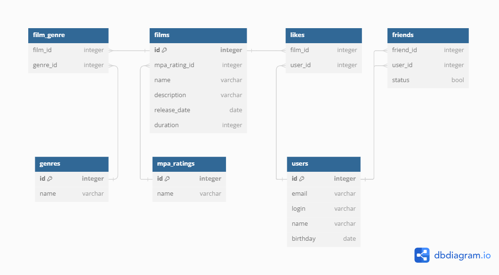

# Java Filmorate
## Описание проекта
**Restful API back-end для сервиса любителей кино. Включает хранение, взаимодействие и управление:
фильмами, пользователями, жанрами и рейтингом.**

## Содержание документа:
- [Стэк технологий](#стэк)
- [Функционал](#функционал)
- [ER-диаграмма](#диаграмма)
- [Описание ER-диаграммы](#описание)
- [Файлы базы данных](#бд)
- [SQL-запросы](#запросы)
- [Ограничения полей (валидация данных)](#валидация)
- [Пошаговая инструкция по установке проекта](#инструкция)


## Стэк технологий {#стэк}
- Java 11, Spring Boot, Maven, Lombok, Junit, JDBC, SQL, H2

## Функционал {#функционал}
### Фильмы:
- добавление, удаление, обновление данных
- поставить/удалить лайк фильму
- получение всех фильмов, по id, наиболее популярных по лайкам, рейтинга MPA
### Пользователи:
- добавление, удаление, обновление данных
- добавление пользователя в друзья
- получение всех пользователей, по id, списка друзей, общих друзей

## ER-диаграмма {#диаграмма}


## Описание ER-диаграммы {#описание}
### films
<details>
<summary>Таблица films</summary>

| Поле | Тип(кол-во символов) | Ключ | Ограничения | Описание |
| --- | --- | --- | -- | --- |
| id | integer | PK (PRIMARY KEY) |  | идентификатор фильма |
| mpa_rating | integer | FK (FOREIGN KEY) | NOT NULL | идентификатор рэйтинга по возрасту (MPA) |
| name | varchar(100) |  | NOT NULL | название |
| description | varchar(255) |  | DEFAULT '' | описание |
| realeseDate | date |  | NOT NULL | дата выхода |
| duration | integer |  | NOT NULL | продолжительность |
</details>

### film_genre
<details>
<summary>Таблица film_genre</summary>

| Поле | Тип(кол-во символов) | Ключ | Ограничения | Описание |
| --- | --- | --- | -- | --- |
| film_id | integer | FK (FOREIGN KEY) |  | идентификатор фильма |
| genre_id | integer | FK (FOREIGN KEY) |  | идентификатор жанра фильма |
</details>

### genres
<details>
<summary>Таблица genres</summary>

| Поле | Тип(кол-во символов) | Ключ | Ограничения | Описание            |
| --- | --- | --- | -- |---------------------|
| id | integer | PK (PRIMARY KEY) |  | идентификатор жанра |
| name | varchar(100) |  | NOT NULL UNIQUE | название жанра кино |
</details>

### mpa_ratings
<details>
<summary>Таблица mpa_ratings</summary>

| Поле | Тип(кол-во символов) | Ключ | Ограничения | Описание |
| --- | --- | --- | -- | --- |
| id | integer | PK (PRIMARY KEY) |  | идентификатор рейтинга |
| name | varchar(100) |  | NOT NULL UNIQUE | название рэйтинга по возрасту (MPA) |
</details>

### users
<details>
<summary>Таблица users</summary>

| Поле | Тип(кол-во символов) | Ключ | Ограничения | Описание |
| --- | --- | --- | -- | --- |
| id | integer | PK (PRIMARY KEY) |  | идентификатор пользователя |
| email | varchar(255) |  | NOT NULL UNIQUE | электронная почта |
| login | varchar(100) |  | NOT NULL UNIQUE | логин |
| name | varchar(50) |  |  | имя |
| birthday | date |  | NOT NULL | дата рождения |
</details>

### friends
<details>
<summary>Таблица friends</summary>

| Поле | Тип(кол-во символов) | Ключ | Ограничения | Описание |
| --- | --- | --- | -- | --- |
| user_id | integer | FK (FOREIGN KEY) |  | идентификатор пользователя |
| friend_id | integer | FK (FOREIGN KEY) |  | идентификатор пользователя |
| status | boolean |  | DEFAULT false | статус (в друзьях или нет) |
</details>

### likes
<details>
<summary>Таблица likes</summary>

| Поле | Тип(кол-во символов) | Ключ | Ограничения | Описание |
| --- | --- | --- | -- | --- |
| film_id | integer | FK (FOREIGN KEY) |  | идентификатор фильма |
| user_id | integer | FK (FOREIGN KEY) |  | идентификатор пользователя |
</details>

## Файлы базы данных {#бд}
- [schema.sql](src/main/resources/schema.sql)
- [data.sql](src/main/resources/data.sql)

## SQL-запросы {#запросы}
### films
<details>
<summary>Запросы к films</summary>

- Добавить фильм
```sql
INSERT INTO films (mpa_rating_id, name, description, releasedate, duration)
VALUES(?, ?, ?, ?, ?);
```
- Обновить фильм
```sql
UPDATE films
SET mpa_rating_id=?, name=?, description=?, releasedate=?, duration=?
WHERE id=?;
```
- Получить фильм по id
```sql
SELECT id, mpa_rating_id, name, description, releasedate, duration
FROM films
WHERE id = ?;
```
- Удалить фильм по id
```sql
DELETE FROM films 
WHERE id=?;
```
- Получить список фильмов
```sql
SELECT id, mpa_rating_id, name, description, releasedate, duration
FROM films;
```
- Получить список популярных фильмов
```sql
SELECT id, mpa_rating_id, name, description, releasedate, duration
FROM films AS f
LEFT JOIN likes AS l ON f.id = l.film_id
GROUP BY f.id
ORDER BY COUNT(l.user_id) DESC
LIMIT ?;
```
</details>

### film_genre (жанры фильма)
<details>
    <summary>Запросы к film_genre</summary>

- Получить жанры фильма
```sql
SELECT g.id, g.name
FROM film_genre AS fg
LEFT JOIN genres AS g ON fg.genre_id = g.id
WHERE fg.film_id=?
ORDER BY g.id;
```
- Добавить жанр к фильму
```sql
INSERT INTO film_genre (film_id, genre_id)
VALUES(?, ?);
```
- Удалить жанр у фильма
```sql
DELETE FROM film_genre
WHERE film_id=?;
```
</details>

### genres (жанры)
<details>
    <summary>Запросы к genres</summary>

- Получить жанр
```sql
SELECT *
FROM genres
WHERE id=?;
```
- Получить список жанров
```sql
SELECT id, name
FROM genres
ORDER BY id;
```
</details>

### mpa_ratings (возрастной рейтинг фильма)
<details>
    <summary>Запросы к mpa_ratings</summary>

- Получить рэйтинг по id
```sql
SELECT *
FROM mpa_ratings
WHERE id=?;
```
- Получить список рейтингов
```sql
SELECT id, name
FROM mpa_ratings
ORDER BY id;
```
</details>

### users (пользователи)
<details>
<summary>Запросы к users</summary>

- Создать пользователя
```sql
INSERT INTO users (email, login, name, birthday)
VALUES (?, ?, ?, ?);
```
- Обновить данные пользователя
```sql
UPDATE users
SET email=?, login=?, name=?, birthday=?
WHERE id=?;
```
- Получить пользователя по id
```sql
SELECT * FROM users
WHERE id=?;
```
- Получить список пользователей
```sql
SELECT id, email, login, name, birthday
FROM users;
```
- Удалить пользователя по id
```sql
DELETE FROM users
WHERE id=?;
```
</details>

### friends (друзья)
<details>
<summary>Запросы к friends</summary>

- Добавить в друзья
```sql
INSERT INTO friends (friend_id, user_id, status)
VALUES(?, ?, ?);
```
- Удалить из друзей
```sql
DELETE FROM friends
WHERE user_id=? AND friend_id=?;
```
- Получить список зяявок в друзья
```sql
SELECT friend_id, user_id, status
FROM friends
WHERE user_id=?;
```
- Получить статус друг или не друг =)
```sql
SELECT friend_id, user_id, status
FROM friends
WHERE user_id=? AND friend_id=?;
```
</details>

### likes (лайки)
<details>
<summary>Запросы к likes</summary>

- Поставить лайк фильму
```sql
INSERT INTO likes (film_id, user_id)
VALUES(?, ?);
```
- Удалить лайк у фильма
```sql
DELETE FROM likes
WHERE film_id=? AND user_id=?;
```
- Получить кол-во лайков фильма
```sql
SELECT COUNT(*) FROM likes
WHERE film_id=?;
```
</details>

## Ограничения полей (валидация данных) {#валидация}
### Users (пользователи)
- "id" может быть только положительным;
- "email" не может быть пустым, не может содержать пробелы. Пример: example@example.example;
- "login" не может быть пустым;
- "name" может быть не заполнен, при этом будет использован email адрес;
- "birthday" не может быть пустым, не может быть в будущем;
### Films (фильмы)
- "id" может быть только положительным;
- "name" не может быть пустым;
- "description" не может быть пустым, минимальная длина описания - 1 символ, максимальная длина описания — 200 символов;
- "releaseDate" не может быть пустым, дата релиза фильма — не раньше 28 декабря 1895 года;
- "duration" не может быть пустым, продолжительность фильма должна быть положительной;
- "mpa" возрастной рейтинг не может быть пустым;

## Пошаговая инструкция по установке проекта {#инструкция}
1. Установите Git: Если у вас еще не установлен Git, загрузите и установите его с официального сайта 
Git: https://git-scm.com/.
2. Клонируйте репозиторий: Откройте командную строку или тер минал и выполните команду клонирования для репозитория GitHub. Например:
```
git clone https://github.com/KoryRunoMain/java-filmorate
```
3. Откройте проект в IDE: Откройте вашу среду разработки (IDE), такую как IntelliJ IDEA, Eclipse или NetBeans.
4. Импортируйте проект как Maven проект: Если вы используете IntelliJ IDEA, 
выберите File -> Open и выберите папку, в которую был склонирован репозиторий. 
IntelliJ IDEA должна автоматически распознать проект как Maven проект и импортировать его.
В Eclipse вы можете выбрать File -> Import -> Existing Maven Projects и выбрать корневую папку проекта.
В NetBeans вы можете выбрать File -> Open Project и выбрать папку проекта.
5. Запустите приложение: точка входа находится в классе "FilmorateApplication" помеченном аннотацией @SpringBootApplication.
Либо запустить через Maven:
```
mvn spring-boot:run
```